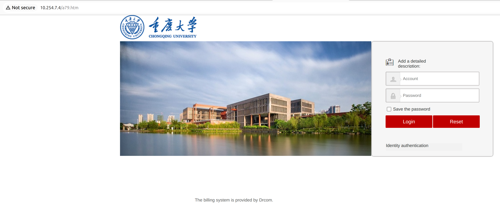
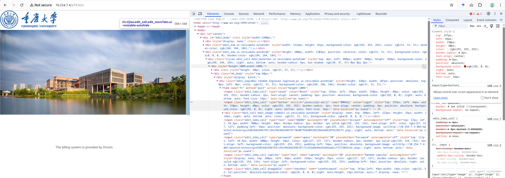
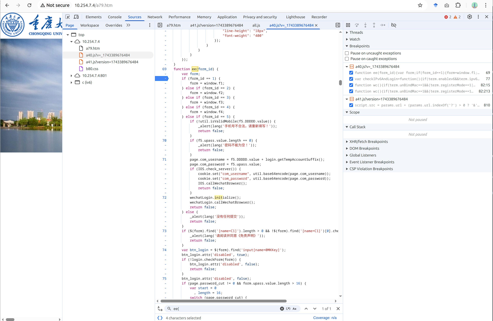
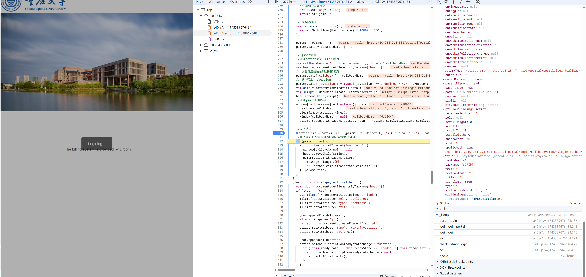
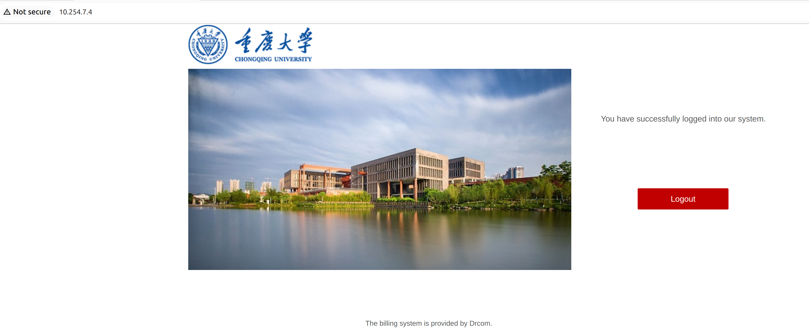
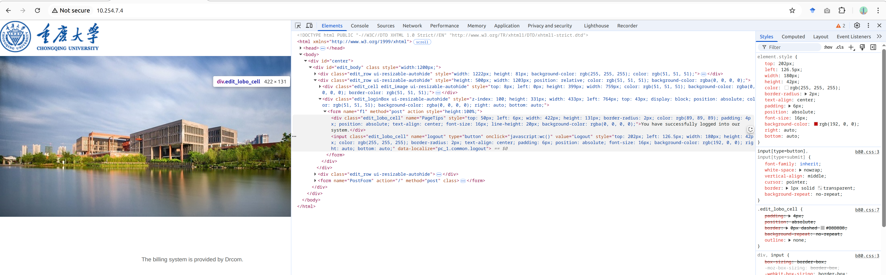
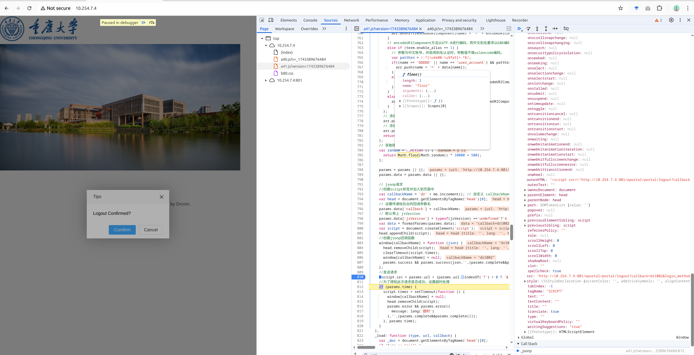

# How to obtain the eportal login and logout urls

We are trying to obtain the login and logout urls of the eportal of Chongquing University (Huxi campus).

The web url of the eportal is [http://10.254.7.4/](http://10.254.7.4/)

## How to obtain the eportal login url
* visit the eportal login page at http://10.254.7.4/a79.htm

* input your username and password in the form fields on the right side
* before clicking the login button, right click your mouse and inspect the source code underline the login button

* one can see that `javascript:ee(1)` is invoked when clicking the login button. find the function from the javascrpt files, which is in `a40.js`

* start debuging and clicking the login button and you will find the full login urls in `script.src`

## How to obtain the eportal logout url
You can obtain the eportal logout url similarly.

* visit the eportal page. Since you have already logged in, you will see the following page:

* inspect the souce underlying the `logout` button and find the logout entry function `javascript:wc()`:

* the entry function is also in `a40.js`, start debugging and clicking the logout button, you will find the full logout urls in `script.src`
 

*Note*, I use Google Chrome above.